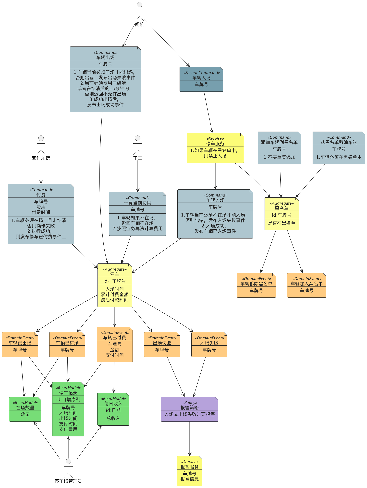

# How to Start

## 图



## Fix

add below code

```kotlin

@Component
class CarBlackListRepositoryImpl :

    CarBlackListRepository {
    override fun findByIdOrError(plate: Plate): CarBlackList {
        TODO("Not yet implemented")
    }

    override fun save(blackList: CarBlackList) {
        TODO("Not yet implemented")
    }
}
```

## Start

Visit: http://localhost:8080/graphiql?path=/graphql

```graphql
mutation {
    checkIn(req:{
        plate:"123"
        time:"2025-05-25T10:00:00"
    })
}
```
